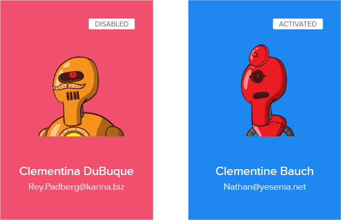
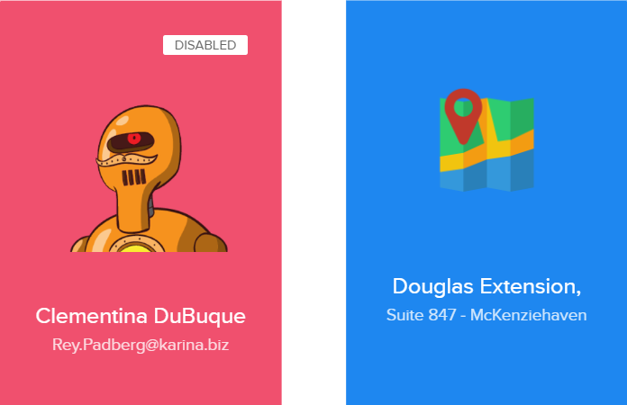

Developed with ReactJS, RoboCards is a web grid of flip cards.

 <br>


## Installation

Install all app dependencies.<br />

```bash
npm install
```

## Start

Runs the app in the development mode.<br />

```bash
npm start
```
